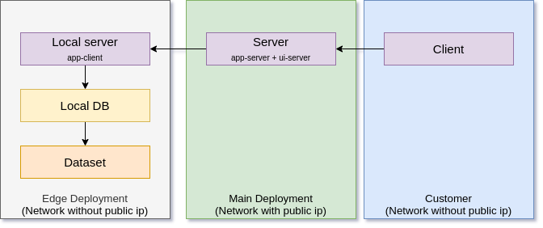

# POC Clickhouse Edges

Proof of concept clickhouse edge installation.

## Overview

- Data locality driven architecture
- Coordinator main deployment server in Public cloud
- Multiple Edge deployments with local DB (Clickhouse local)

- `src/app-coordinator` Coordinator application
- `src/ui-coordinator` UI for coordinator
- `src/app-edge` Edge application
- `src/deploy` Deployment scripts

## Tech stack

- Spring Framework 5.3
- Apache Camel 3.11
- Angular 12
- RxJS 6
